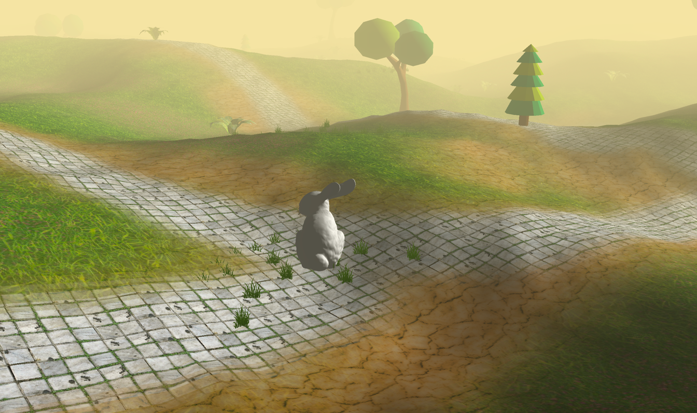

# ThinMatrix Game

This "game" is mostly the product of the tutorial series "OpenGL 3D Game Tutorials" published on YouTube by ThinMatrix.

https://youtu.be/VS8wlS9hF8E

This code was meant to be a migration of his tutorial game from LWJGL 2 to modern LWJGL 3, but along the way, I have made customizations that either made sense to me or were just necessary as a consequence of porting his tutorial game to LWJGL 3.

Because I am still writing OpenGL on macOS, this repository will likely not use any of the OpenGL features beyond 4.1, though I may maintain builds for both Windows and Linux.

Thank you, ThinMatrix for your fantastic tutorials and I hope everyone finds this ported code useful.

NOTE: Please notice that I have mostly made commits for each of the episodes in the tutorial series. I have done this so each lesson can be examined in detail by reverting the code to the desired lesson.

## Keyboard Controls
* W is forward movement
* S is backward movement
* A is turn left
* D is turn right
* SPACE BAR is jump

Keyboard arrow keys also work for movement. Mouse input is buggy. Good luck!

## Dependencies
 * LWJGL 3

 
